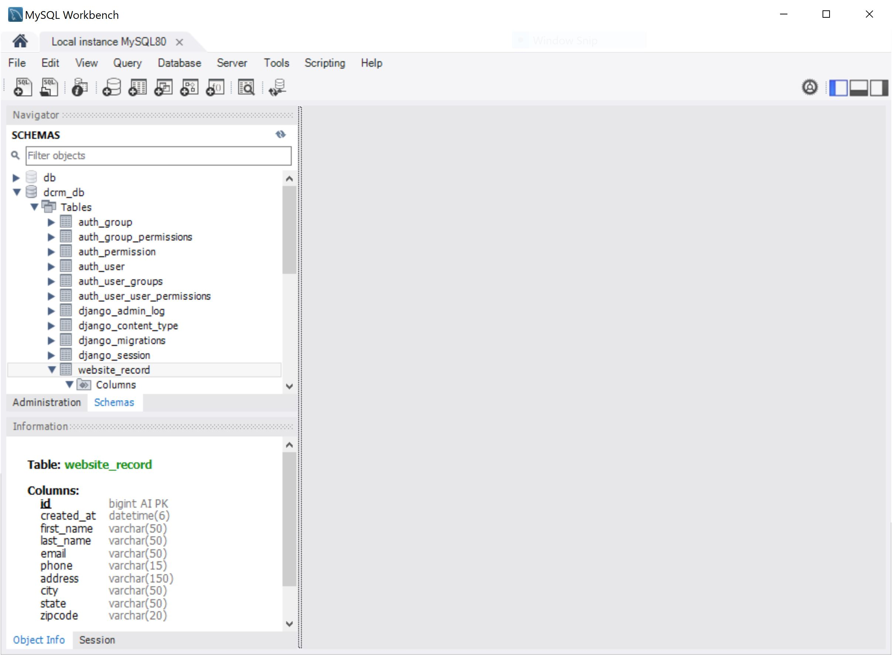
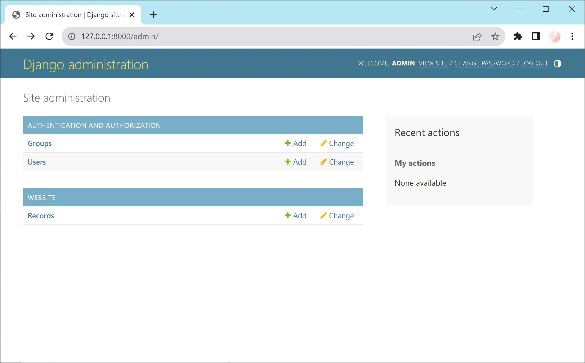
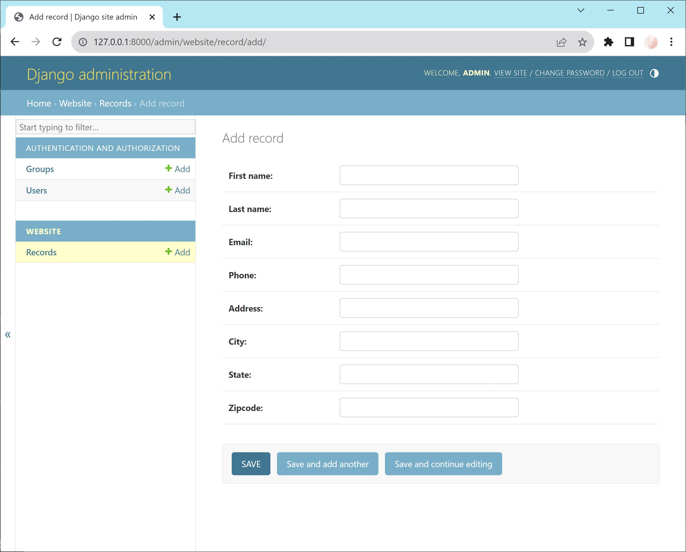

# Database Model

## What is a model?

In Django, a model is a Python class that represents a database table. It defines the fields (attributes) and
behaviors (methods) of the data to be stored in the database. Each instance of the model class represents a row in the
corresponding database table.

A model.py file in Django contains the definitions of these models. It is where you define your data models using Python
classes, including the fields, relationships, and any necessary methods. These models are used to create, retrieve,
update, and delete data in the database, and they serve as the backbone of the Django ORM (Object-Relational Mapping)
system, which abstracts the database interactions.

## 1. Create model

The model is defined in [models.py](../dcrm/website/models.py):

```python
from django.db import models


class Record(models.Model):
    created_at = models.DateTimeField(auto_now_add=True)
    first_name = models.CharField(max_length=50)
    last_name = models.CharField(max_length=50)
    email = models.CharField(max_length=50)
    phone = models.CharField(max_length=15)
    address = models.CharField(max_length=150)
    city = models.CharField(max_length=50)
    state = models.CharField(max_length=50)
    zipcode = models.CharField(max_length=20)

    def __str__(self):
        return (f"{self.first_name} {self.last_name}")

```

### String representation

The `__str__` is a built-in special method that controls the string representation of the object. The string is
constructed using an *f-string* (formatted string literals), denoted by the f prefix before the opening quote. It
returns a formatted string representing the object.

## 2. Migration

Open the terminal and create the database migration files:

```console
python manage.py makemigrations
```

This command is used to create new database migration files based on the changes you made to your Django models. When
you modify your models (add new fields, remove fields, etc.), this command generates migration files that represent the
changes you made. After execution the [migration](../dcrm/website/migrations/0001_initial.py) in the migrations
directory is created. An ID like primary_key is automatically created and added by Django.

To apply migrations to the database run:

```console
python manage.py migrate
```

This command is used to apply the pending database migrations to your database. It updates the database schema to
reflect the changes defined in the migration files created using `makemigrations`. It synchronizes the database with the
current state of your models and keeps your database schema up to date.

## 3. MySQL Workbench

The database model is for the table **website_record** is now in the MySQL Workbench:


## 4. Django administration

To add the database to the Django administration, the file [admin.py](../dcrm/website/admin.py) needs to
register the record from the model like this:

```python
from django.contrib import admin
from .models import Record

admin.site.register(Record)
```


