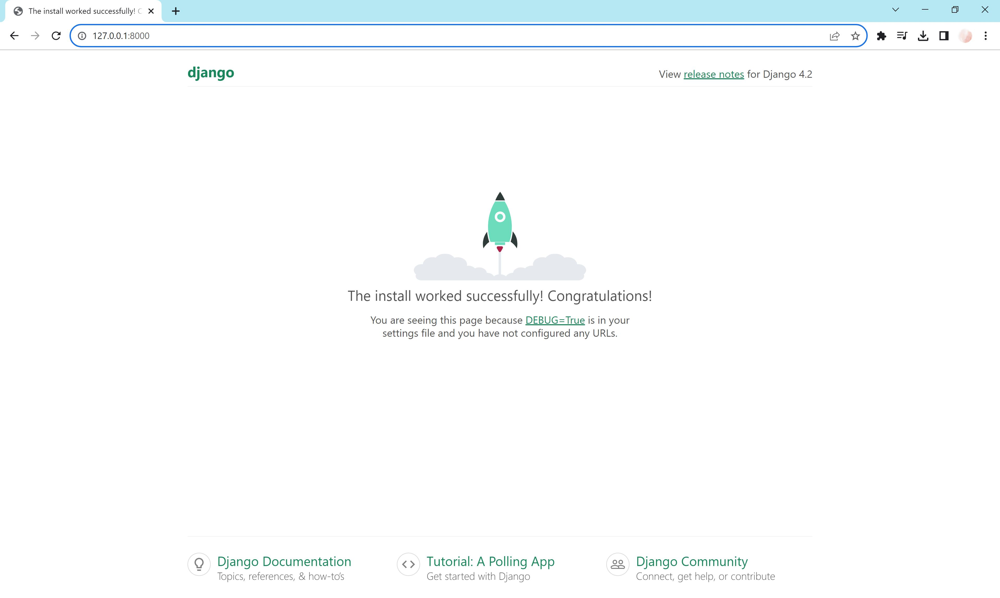

# MYSQL Configuration

## Settings
Open the project in PyCharm Community or any other IDE.
Change the app setting within the [settings.py](../dcrm/dcrm/settings.py) file and configure like this.
- Add app 'website' to INSTALLED_APPS
- Change the database in DATABASES:
```python 
DATABASES = {
    'default': {
        'ENGINE': 'django.db.backends.mysql',
        'NAME': 'dcrm_db',
        'USER': 'root',
        'PASSWORD': 'pass',
        'HOST': 'localhost',
        'PORT': '3306'
    }
}
```

## Create the database
Open the terminal and navigate to [dcrm-directory](../dcrm). To create the database setup script run the following command:

### Step 1: Create the create_database.py file
```console
touch create_database.py
```

### Step 2: Add the database creation code
Copy and paste the following code into the [create_database.py](../dcrm/create_database.py) file:
```python
import mysql.connector

dataBase = mysql.connector.connect(
    host='localhost',
    user='root',
    passwd='pass',
)

# Prepare cursor object
cursorObject = dataBase.cursor()

# Create database
cursorObject.execute("CREATE DATABASE dcrm_db")

print("Created database")
```

### Step 3: Execute the script
The script will now create the database for you. 

```console
python create_database.py
```

### Step 4: MySQL Workbench
To confirm that the database was created look for the schema **dcrm_db** in MySQL Workbench.

## Migration

```console
python manage.py migrate
```

In MySQL Workbench the Django default tables are added to the database **dcrm_db**.

## Create a user
```console
winpty python manage.py createsuperuser
```
The created user has the following credentials:
- user: admin
- password: password

## Run server
To start the Django development server, use the following command:
```console
python manage.py runserver
```
By default, the django server will run [here](http://127.0.0.1:8000/).

### Preview



