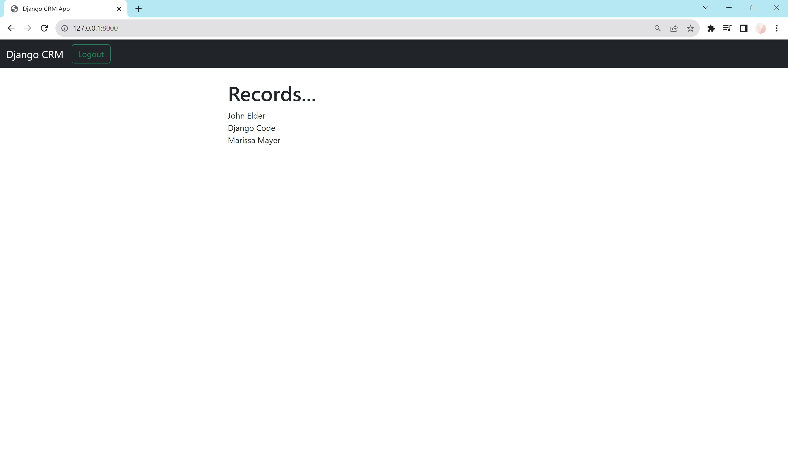
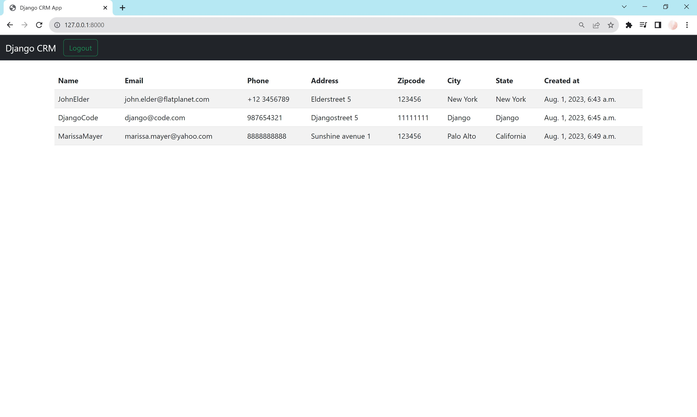

# Record Table

This section explains on how to bring the records on the website and implement a Bootstrap table.

## Bring data to website

[views.py](../dcrm/website/views.py)

```python
from .models import Record


def home(request):
    records = Record.objects.all()
    return render(request, 'home.html', {'records': records})
```

[home.html](../dcrm/website/templates/home.html)

```html
<h1>Records...</h1>


{{ record }} <br/>


```

The records in the database are now displayed in the home-view, with it's string representation as defined in the model.
Therefore the first and last name are displayed:



## Bootstrap table

A table gives a better representation of the data, so
a [bootstrap table](https://getbootstrap.com/docs/4.0/content/tables/) can be used. This loops through the records and
creates a table row `<tr>` for each record in records.

```html

<table class="table table-striped table-hover table-bordered">
    <thead>
    <tr>
        <th scope="col">Name</th>
        <th scope="col">Email</th>
        <th scope="col">Phone</th>
        <th scope="col">Address</th>
        <th scope="col">Zipcode</th>
        <th scope="col">City</th>
        <th scope="col">State</th>
        <th scope="col">Created at</th>
    </tr>
    </thead>
    <tbody>
    
    
    <tr>
        <td>{{ record.first_name }}{{ record.last_name }}</td>
        <td>{{ record.email }}</td>
        <td>{{ record.phone }}</td>
        <td>{{ record.address }}</td>
        <td>{{ record.zipcode }}</td>
        <td>{{ record.city }}</td>
        <td>{{ record.state }}</td>
        <td>{{ record.created_at }}</td>
    </tr>
    
    
    </tbody>
</table>
```



